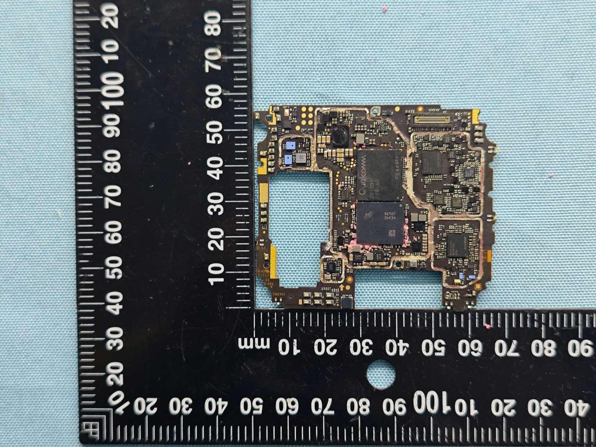
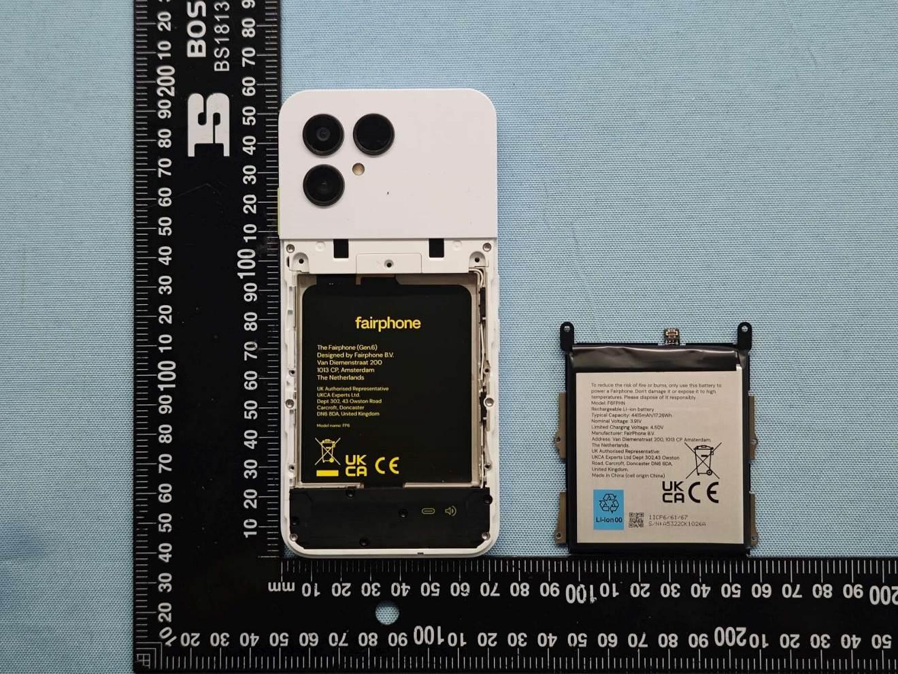
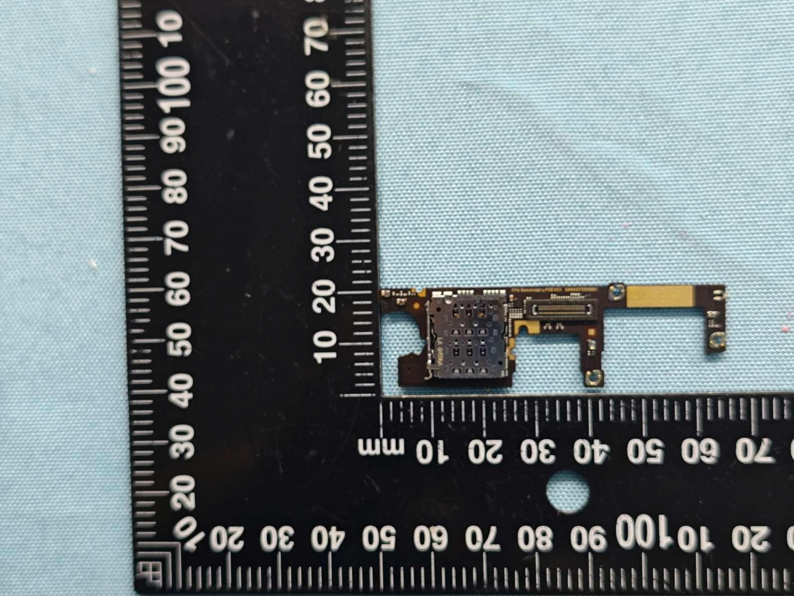
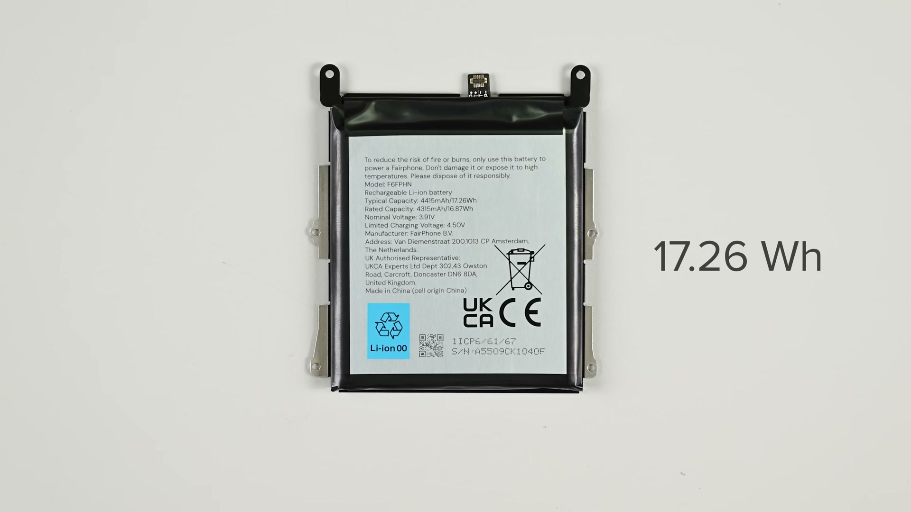
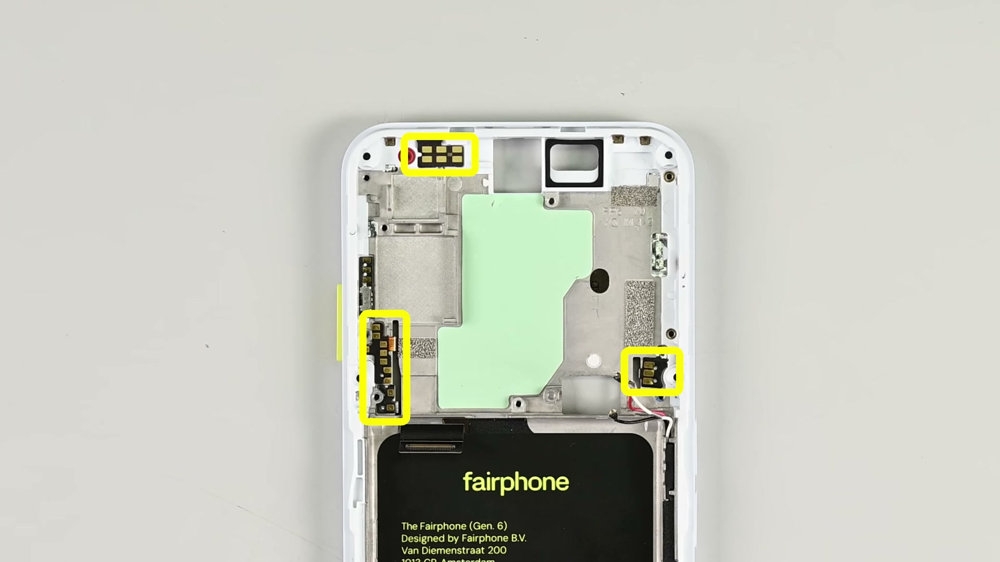
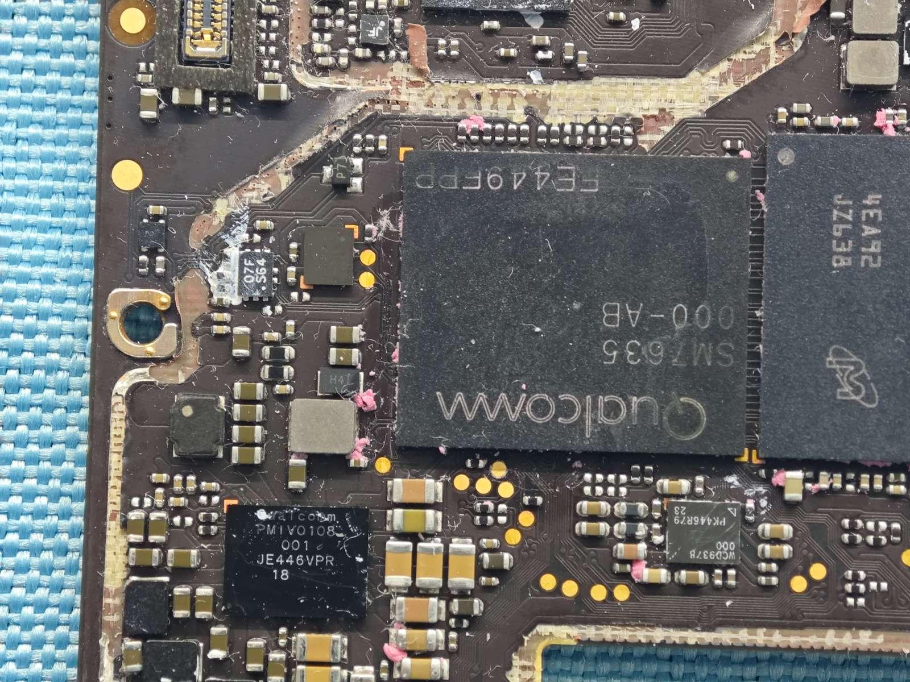
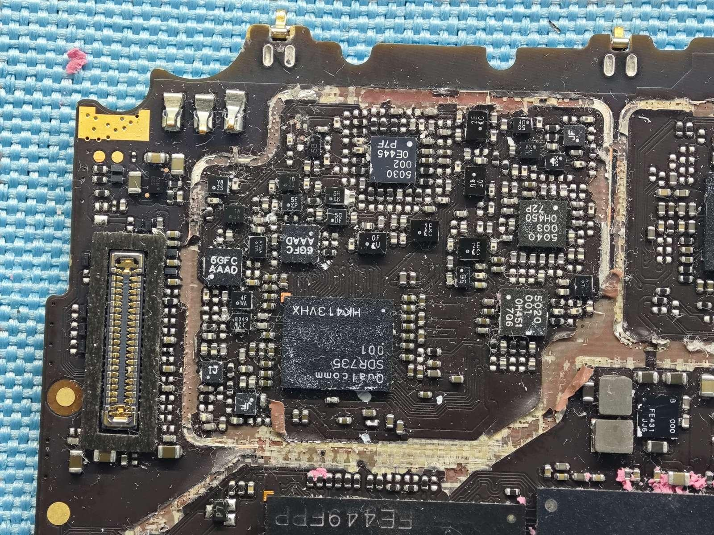
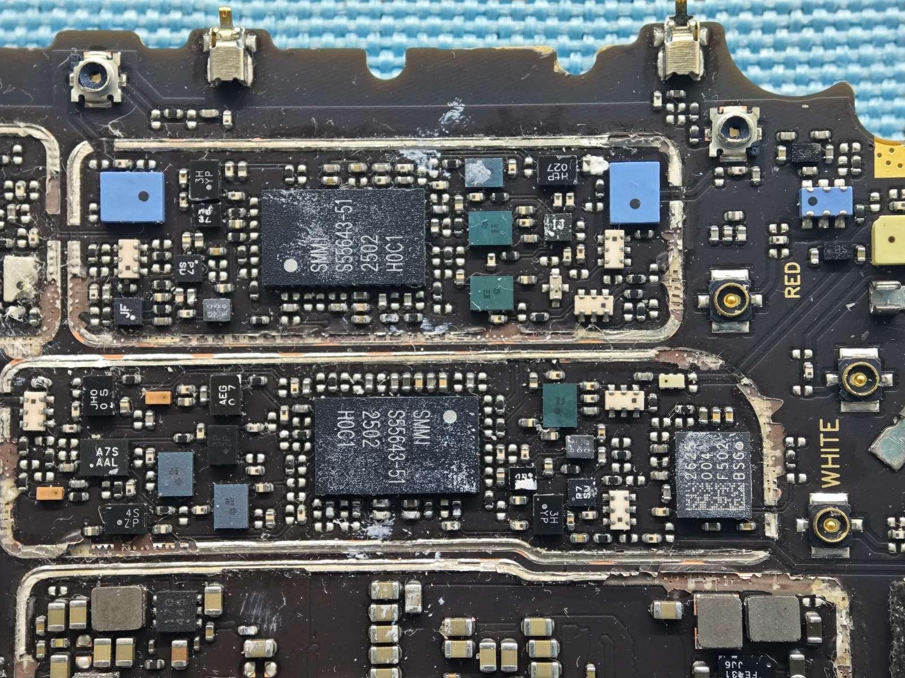
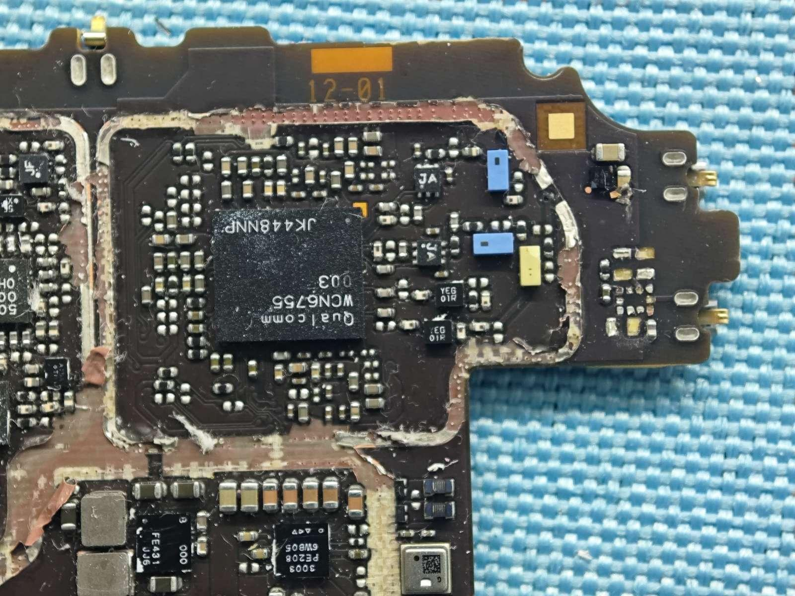
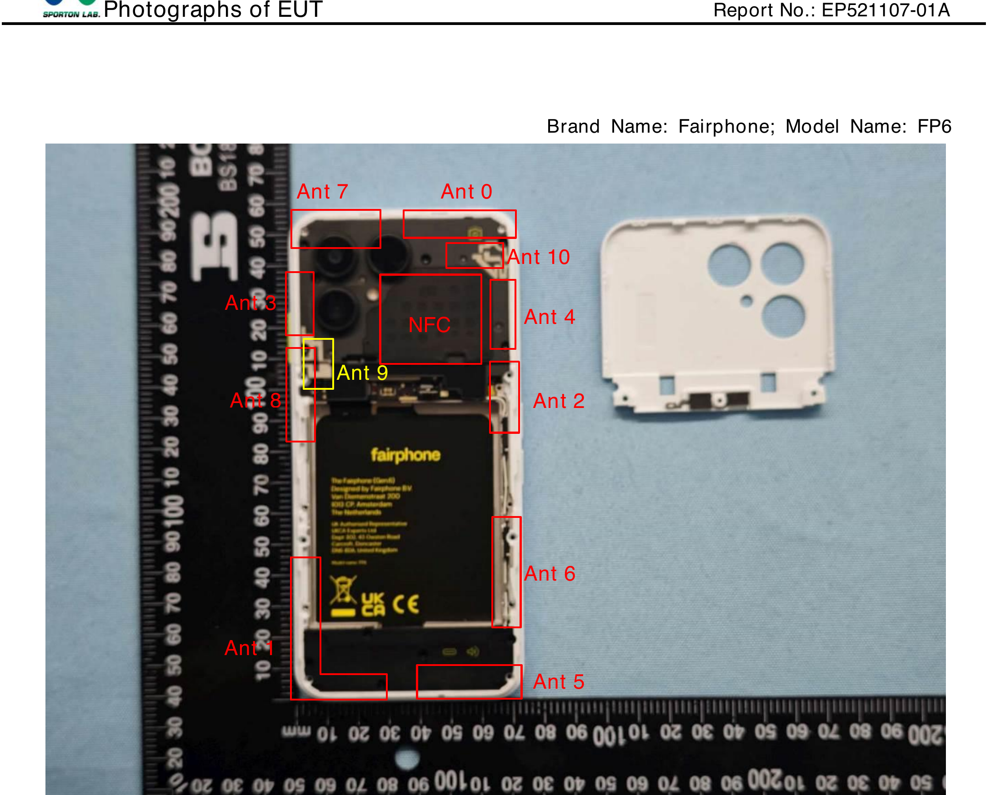

# Can You Actually Build a Phone From Scratch? — working draft

> **Status:** skeleton — key bullets + image picks. Prose not written yet.
> **Working titles:** "Nobody Builds a Phone From Scratch (Not Even Fairphone)" ·
> "An Engineer's Field Guide to Building a Phone" · "The Four Ways Into the Phone Business"
> **Audience:** engineer-curious reader; payoff = honest feasibility verdict for a small team.
> **Evidence base:** FP6 teardown videos (iFixit, JerryRigEverything), the full FCC filing
> (2AUWUFP6, 160 exhibits), our own working BOM for a ~10k-unit custom phone, and the two
> phones that inspired the spec: Fairphone 6 ([fairphone.md](fairphone.md)) and the Finnish
> Jolla Phone ([jollaPhone.md](jollaPhone.md)).
> Deep-dive docs: [fairphone6_video_teardown_analysis.md](fairphone6_video_teardown_analysis.md) ·
> [fairphone6_fcc_rf_analysis.md](fairphone6_fcc_rf_analysis.md) ·
> [custom_phone_design_decision_summary.md](custom_phone_design_decision_summary.md)

## The spec — my current selections

The working spec this whole post orbits around (full decision log:
[custom_phone_design_decision_summary.md](custom_phone_design_decision_summary.md)):

| Subsystem | My selection |
|---|---|
| SoC | Qualcomm Snapdragon 7 Gen 4 (SM7750-AB, 4 nm) |
| RAM | 12 GB LPDDR5X |
| Storage | 256 GB UFS 4.0 |
| Display | 6.36" 1080×2400, 120 Hz AMOLED, matte glass option |
| Main camera | Sony LYTIA 808, 50 MP, OIS |
| Front camera | Samsung ISOCELL 3LU, 12 MP, autofocus |
| Battery | 6000 mAh silicon-carbon, **removable** |
| Biometrics | Fingerprint in power button (Goodix), no Face ID |
| SIM | eSIM-only (no tray) |
| Charging | USB-C, 45 W PD |
| Audio | ≥3 mics, stereo speakers |
| Haptics | LRA actuator |
| OS | AOSP / custom Android, hardened (verified boot, TEE, SELinux enforcing) |
| Target | ~10k units, ≈$170–220 hardware BOM (pre-2026-memory-surge estimate) |

---

**Image licensing plan**
- ✅ **FCC exhibit photos** (`FCC_.../_extracted/inpho/raw/*.png`) — public regulatory filings; safe to publish; nobody else's blog uses them. These carry the post.
- ⚠️ **iFixit stills** (`videos/key/ifx_*.jpg`) — iFixit publishes under **CC BY-NC-SA**; usable on a non-commercial blog *with attribution + same-license note*.
- ❌ **JerryRig stills** (`videos/key/jr_*.jpg`) — plain copyright; keep as internal reference only, link to the video instead.
- ➕ **To make:** 2 original SVG diagrams — (1) phone architecture block diagram, (2) "four entry paths" ladder.

---

## 0. Hook

- 2013 promise: "a fair, repairable phone." 2025 reality check hiding in a public FCC filing:
  the Fairphone 6's antenna report is authored by **T2 Mobile (Shanghai) — TCL's ODM arm** —
  and measured at TCL's Ningbo lab. Device part number `BQA6CT0A15C0`.
- **Thesis: nobody builds a phone from scratch — not even Fairphone.** You enter the market at
  one of four altitudes. This post walks down the ladder, with real photos, real part numbers,
  and a real BOM.
- We know this because a US phone launch dumps its guts into the public record: 160 documents,
  459 MB, including labeled antenna maps and naked-board photos. That filing + two teardown
  videos + our own attempt to spec a custom phone = this post.

*Caption: ~62 × 54 mm. Everything a phone is, in one L-shaped board. (FCC ID 2AUWUFP6, internal photos.)*

---

## 1. What's inside a modern phone (teardown walkthrough)

Specimen: Fairphone (Gen. 6) — €549, IP55, iFixit 10/10 repairability.

- **Module map:** mainboard (top 40%) · battery (middle) · daughterboard + speaker/vibe +
  USB-C module (bottom) · display · camera cover · 3 cameras + ToF · earpiece.
- **One screw type for the whole phone** (T5 Torx, ~26 screws). Battery swap ≈ 2 min,
  screen swap ≈ 5 min, no adhesive anywhere except the button-flex pads.
- **Battery construction trick:** bare pouch (4415 mAh, 3.91 V nom / 4.50 V limit, cell code
  1ICP6/61/67) glued to a thin stamped-steel carrier with screw ears → a floppy pouch becomes
  a screw-down replaceable part with no plastic shell.
- **Three interconnect classes, chosen by who breaks the joint:**
  - B2B connectors → parts a *customer* swaps (battery, display, cameras, earpiece);
  - spring/pogo contacts → parts a *technician* swaps (buttons, fingerprint, NFC, antennas,
    speaker module, USB-C module);
  - coax (3×, jackets color-coded and silkscreened WHITE/RED/BLACK) → antenna runs.
- **The mainboard has zero screws** — the camera cover's foam pads preload it onto pogo pins.
- **The "third camera" is a lie** — it's a ToF depth sensor, sharing a flex with the LED
  light-pipe inside the camera cover.
- Cost of repairability: IP55 instead of IP68, 9.6 mm thick, USB 2.0.

*Caption: back cover and battery out. The screwed lower cover + clip-on upper cover carry the phone's structure.*

*Caption: the ~70 × 20 mm secondary PCB — SIM/µSD reader, antenna feed pads, B2B. Ports and speakers land on it so the expensive board never gets touched in a port repair.*

*Caption (⚠️ iFixit CC BY-NC-SA, attribute): every number you need to clone the battery architecture is printed on the label.*

*Caption (⚠️ iFixit CC BY-NC-SA): the price of "no connectors" — button/fingerprint flexes glued to the frame; iFixit calls this the one fiddly repair.*

---

## 2. The silicon reality: you don't pick chips, you pick a platform

- Open the shields and it's a **Qualcomm solar system**: Snapdragon 7s Gen 3 (`SM7635`) with
  LPDDR5 stacked on top, and around it the *mandatory companion kit* —
  `SDR735` RF transceiver · `PM7550` + `PM8550VS` PMICs · `WCN6755` Wi-Fi 6E/BT ·
  `WCD937B` audio codec. Plus Micron UFS 3.1 storage.
- **The modem is not a chip you choose** — it's inside the SoC. The Quectel/SIMCom modules
  beginners reach for only pair with non-cellular application processors.
- What *is* chosen per-design: the **RF front-end** — one Qualcomm QPM PA module, two
  third-party PAMiD/receive modules (Skyworks-style `S55643-51`), a constellation of tuners
  and switches — all dictated by the band plan.
- **11 antennas + NFC** in a €549 mid-ranger: 8 for cellular (n41 and n77/78 each need four,
  for 4×4 MIMO/SRS), 3 Wi-Fi/BT IFAs, one 40.7 × 29.15 mm NFC loop. All laser-structured onto
  plastic parts around a metal core — this is why the frame is plastic-overmoulded.
- SAR compliance is **Qualcomm Smart Transmit**: per-antenna, per-scenario power tables loaded
  into the modem's filesystem. You inherit it; you don't build it.

*Caption: Snapdragon 7s Gen 3 (`SM7635 000-AB`) with DRAM on top; Micron UFS beside it; PMIC below.*

*Caption: the discrete radio — Qualcomm `SDR735` transceiver surrounded by RFFE parts, antenna feeds top-left.*

*Caption: two identical PAMiD modules (`S55643-51`) in their own shield fences; RED/WHITE coax feeds on the right.*

*Caption: `WCN6755` Wi-Fi 6E/Bluetooth — the connectivity block is also Qualcomm.*

*Caption: the money shot — Sporton's antenna location map. Ant 0–6, 8 = cellular; 7, 9, 10 = Wi-Fi/BT; NFC under the camera cover.*

---

## 3. Our attempt: the spec sheet we wrote before we knew better

- Before the teardown, we drew up our own full design spec / decision sheet for a ~10k-unit
  custom phone — 21 sections, from SoC to sealing:
  [custom_phone_design_decision_summary.md](custom_phone_design_decision_summary.md).
- **Two phones inspired it** (both analyzed as references before the spec was written):
  - **Fairphone 6** — the repairability template: removable battery, screwed modules,
    long software support;
  - **Jolla Phone (2026, Finland)** — the values template: Sailfish OS instead of Google,
    hardware **privacy switch**, user-replaceable 5450 mAh battery, swappable back cover,
    **assembled in Finland**, €649 — and proof a ~MediaTek Dimensity 7100 mid-ranger is
    enough. Also the proof that a tiny company *can* ship: Jolla is what remains of the
    Nokia MeeGo team.
- Key selections (working costs at ~10k units):

| Subsystem | Our pick | Working cost | vs. Fairphone 6 |
|---|---|---|---|
| SoC | Snapdragon 7 Gen 4 (SM7750-AB, 4 nm) | $30–40 | one gen newer than FP6's 7s Gen 3 |
| RAM / storage | 12 GB LPDDR5X / 256 GB UFS 4.0 | $10–15 / $15–22 | FP6: 8 GB LPDDR5 / UFS 3.1 |
| Display | 6.36" 1080×2400 120 Hz AMOLED | $25–40 | FP6: 6.31" LTPO, 10–120 Hz |
| Main camera | Sony LYTIA 808, 50 MP, OIS | $20–30 | FP6: LYTIA 700C |
| Front camera | Samsung ISOCELL 3LU, 12 MP AF | $3–7 | FP6: 32 MP KD1 |
| Battery | **6000 mAh silicon-carbon, removable** | $8–12 | FP6: 4415 mAh removable |
| Biometrics | Fingerprint in power button (Goodix) | $1–3 | same approach as FP6 |
| SIM | **eSIM-only** (no tray) | — | FP6: nano-SIM + eSIM + µSD |
| Charging | 45 W USB-C PD | $2–6 | FP6: 30 W, USB 2.0 |

- What the spec sheet got right *before* the teardown: removable battery, button fingerprint,
  modular ambitions, mid-range Snapdragon.
- What the teardown/FCC work corrected: we had a **"pick a modem module" section
  (Quectel/SIMCom/Cat-1 bis) that was simply wrong** for a Snapdragon phone — the modem is
  on-die, and the real gaps are the RF front-end and an 8+3+NFC antenna set (§2). The spec's
  §7 was rewritten accordingly.
- Still open on our sheet, honestly listed: RFFE parts, antennas, PMIC details, Wi-Fi/BT,
  NFC, audio, haptics, thermal, sealing, BSP/certification — i.e., everything the ODM
  ecosystem (§5) exists to solve.

## 4. The money: a working BOM and the certification wall

- Our working 10k-unit BOM (from the custom-phone exercise): SoC $30–40 · RAM $10–15 ·
  storage $15–22 · display $25–40 · main camera $20–30 · battery $8–12 · RFFE $8–15 ·
  companion kit $12–20 · plus PMIC/USB/sensors/mechanical → **≈$150–200 electronics BOM**
  before assembly, before software, before certification. [TODO: tighten & total properly]
- Fairphone's spare-part prices as a sanity check: battery €39.95 · display €89.95 ·
  USB-C €19.95 · camera €69.95.
- **The certification wall** (the real moat):
  - FCC: 160 exhibits from one lab (SAR alone spans ~40 documents; n77/78 testing is 8 parts).
  - Then CE/RED, PTCRB/GCF, carrier certifications, TCO if you want the eco label.
  - [TODO: ballpark $ figures for full cert stack — industry estimates $0.5–1M+ for global]
- Software is a parallel BOM: Android BSP + 8 years of updates is a staffed team, and
  **you cannot ship Google apps without a GMS/MADA license** — usually accessed via a
  licensed ODM/3PL. [TODO: verify current MADA/EMADA path for small OEMs]

---

## 5. The ecosystem: who actually builds phones

- **ODMs** design and build most of the world's phones: Wingtech, Huaqin, Longcheer,
  **T2 Mobile (TCL)** — the FP6's actual engineer. [TODO: profiles, typical MOQs, how to engage]
- **IDHs / design houses** for semi-custom work; Qualcomm/MediaTek reference designs are the
  starting point for everything.
- **Component tier:** BOE/TCL-CSOT/Tianma (displays) · ATL/Sunwoda/Desay (batteries) ·
  Sunny Optical/O-Film/LuxVisions (camera modules) · Skyworks/Qorvo/Murata/Qualcomm (RFFE) ·
  AAC/Goertek (acoustics, haptics). [TODO: verify + add contact/MOQ notes]
- **The open-ish corner:** Pine64 (PinePhone), Purism (Librem 5), Fairphone, SHIFT,
  Teracube, Light Phone, Punkt, Jolla/Sailfish, /e/OS & Murena, LineageOS, postmarketOS.
- **Jolla is the interesting counter-example to the Qualcomm default:** MediaTek SoC +
  Sailfish OS + Finnish final assembly — a whole alternative stack (AOSP-free UI, no GMS)
  that survived 12+ years on niche volumes. [TODO: who does Jolla's hardware/ODM? verify]
- Alt-OS reality check from our notes: [os.md](os.md), [jollaPhone.md](jollaPhone.md),
  [lightphone_specs.md](lightphone_specs.md).

---

## 6. The four entry paths (the ladder diagram)

1. **White-label / rebrand** — pick an ODM catalog phone, your logo, your firmware skin.
   ~$50k–200k, MOQ 3–10k, 6 months. You own: brand + distribution. (Punkt, early Light Phone-ish)
2. **Semi-custom ODM** — your ID/mechanical + reference-design electronics; ODM does RF,
   antennas, certification. This is the **Fairphone route**. ~$1–5M, MOQ 10k+, 12–24 months.
3. **Linux-phone route** — non-Qualcomm AP (i.MX/Rockchip) + M.2/soldered modem module
   (Quectel/Broadmobi), community OS. No Qualcomm NDA, genuinely open hardware — but 2016-era
   performance and no GMS. (PinePhone ~$150 BOM-class, Librem 5 — $2M+ and years late.)
   This is where our original Quectel/Cat-1 bis idea actually lives.
4. **From scratch** — own board, own RF, own antennas, own cert program. Effectively nobody
   does this outside the top ~10 OEMs; even they lean on Qualcomm reference designs.
- **Where our 10k-unit custom phone lands: path 2**, with path 3 as the ideological fallback.

---

## 7. Feasibility verdict

- **Yes, you can "build a phone"** — for the definitions of *build* on rungs 1–3.
- Capital tiers: rung 1 = low six figures · rung 2 = low seven figures · rung 3 = seven
  figures + a community · rung 4 = don't.
- Survivors vs. graveyard: Fairphone (niche + EU repair regulation tailwind + ODM leverage),
  Light Phone & Punkt (minimalism niche), Jolla (survived by pivoting to B2B/licensing, then
  returned in 2026 with a consumer phone assembled in Finland) —— vs. Essential
  ($330M raised, dead in 2.5 yrs), Andy Rubin's… [TODO: 2–3 tight case studies with numbers]
- The durable niches are **values-based** (repairability, privacy, minimalism), not spec-based —
  you cannot out-spec the BBK/Samsung/Apple machine at any realistic volume.
- Closing: the FCC filing that started this post is also the beginner's best textbook —
  every US phone's guts are public at fccid.io. Go read one.

---

## 8. Resources & further reading (to compile)

- FP6 FCC filing: https://fccid.io/2AUWUFP6 (grant 2025-08-24, photos public since 2026-02-21)
- iFixit FP6 teardown (video bXseyTdynCo) + repair manuals; JerryRig durability (ov752bRItA0)
- Fairphone spec/impact pages; Fraunhofer lifetime-CO₂ study (5 yr use ≈ −⅓ footprint)
- Qualcomm Snapdragon 7-series product briefs (7s Gen 3 / 7 Gen 4 SM7750-AB)
- Our docs: teardown analysis · FCC RF analysis · decision summary (BOM)
- [TODO: ODM contact points, Pine64/Purism postmortems, GMS licensing explainer links,
  PTCRB/GCF fee schedules, EU repairability-index links]

---

## Appendix candidates (may cut)

- Full antenna→band→power table (from SAR Part-0/Part-1)
- Full silicon ID table with confidence levels
- Disassembly order / fastener map table
- Image credits & licenses block
