# Jolla Phone (2026) Teardown

Source: https://www.ifixit.com/Teardown/Jolla+Phone+(2026)+Teardown/223943 (iFixit, CC BY-NC-SA)
Author: frengel · Downloaded 2026-09-04 via iFixit API 2.0

**Intro:** Quick and dirty tear-down of the Jolla Phone (2026)[br]
This is not a replacement guide and these steps are not guaranteed to be correct.[br]

## Step 1: Step 1

- Using a fingernail remove the SIM card tray.

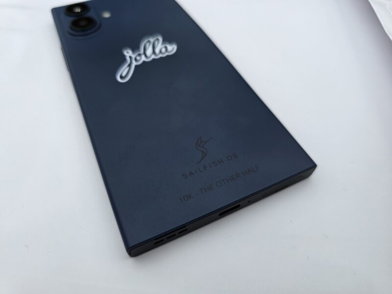

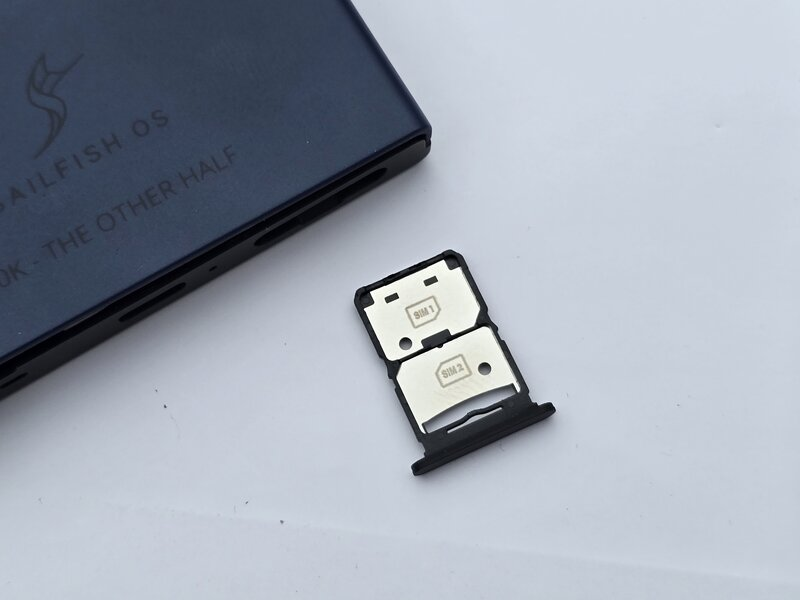

## Step 2: Step 2

- There is a small slot next to the USB port to pull up the cover.
- The back cover is clipped on tight, bend it a little to release all clips.

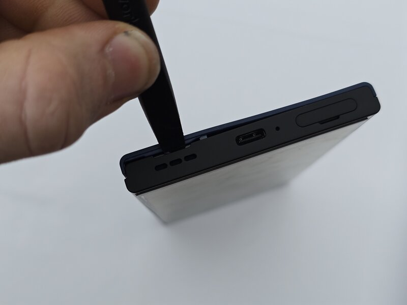

## Step 3: Step 3

- Using a Philips PH0 to Remove the  two screws of the battery bracket.
- These screws are longer that the rest of the screws

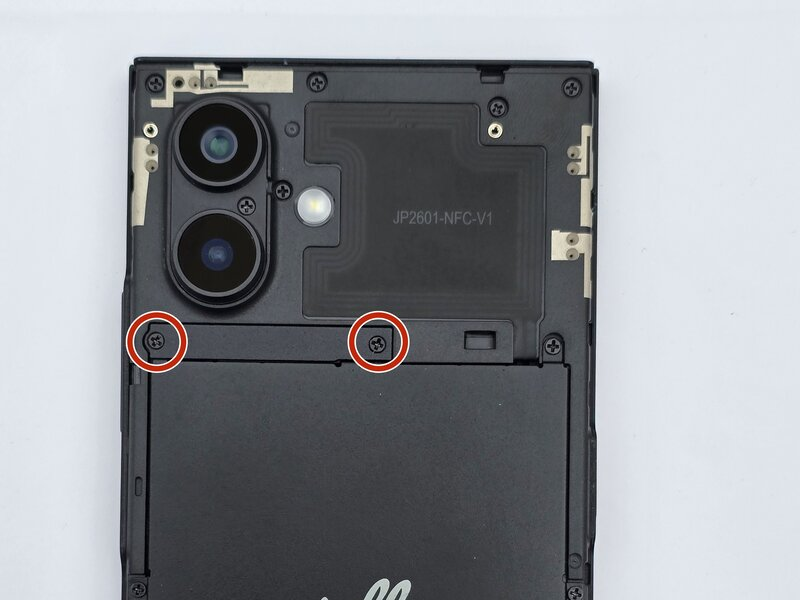

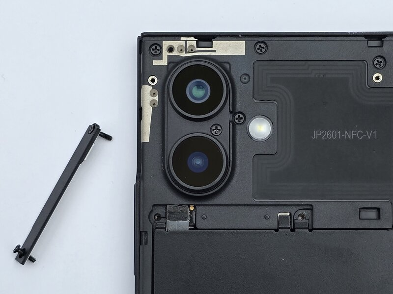

## Step 4: Step 4

- Unplug the battery connector using a spatula or fingernail.

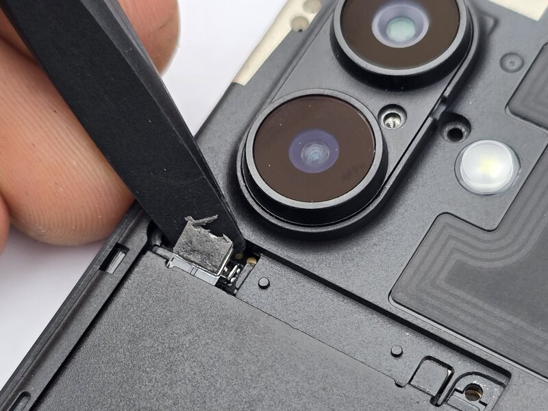

## Step 5: Step 5

- Remove 6 battery screws using PH0 screwdriver and lift out the battery.

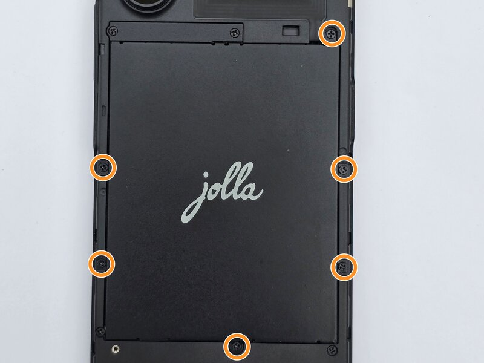

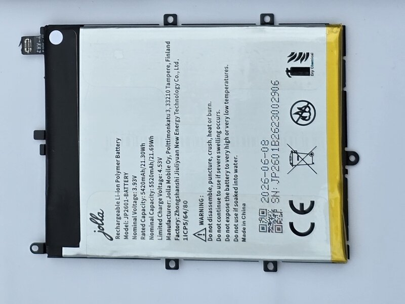

## Step 6: Step 6

- Using a spudger or fingernail partially remove this sticker.

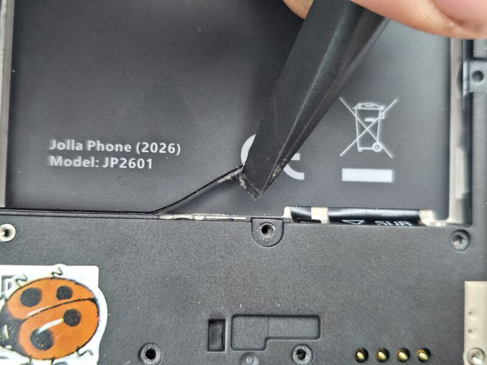

## Step 7: Step 7

- Using a PH0 screwdriver remove 10 screws.
- Using a PH0 screwdriver remove 1 screw. This screw is smaller than the rest.

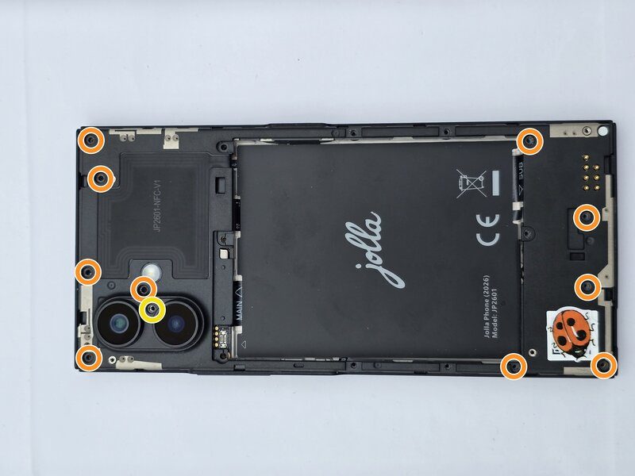

## Step 8: Step 8

- Remove the mid frame of the phone.
- Warning. There is a possibility one or both of the cameras stick to the mid frame. Look out for the camera connector.
- There is a clip on the mid frame, this keeps  the top part down and by carefully pulling the mid frame towards the charging port it will release.

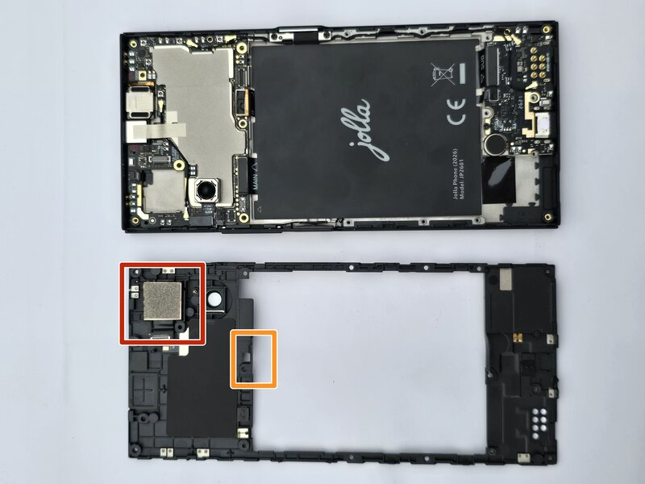

## Step 9: Step 9

- Partially remove the sticker next to the switch bracket.

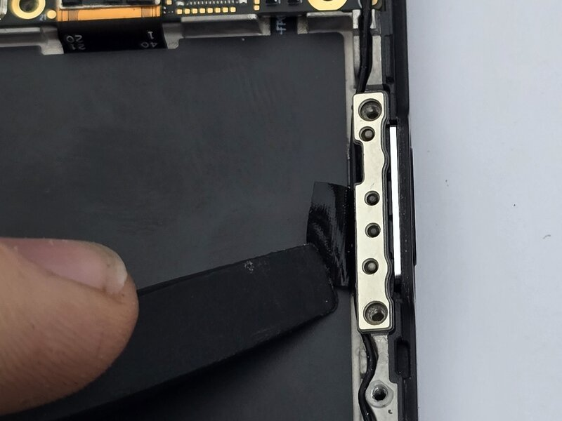

## Step 10: Step 10

- Remove both antenna cables.

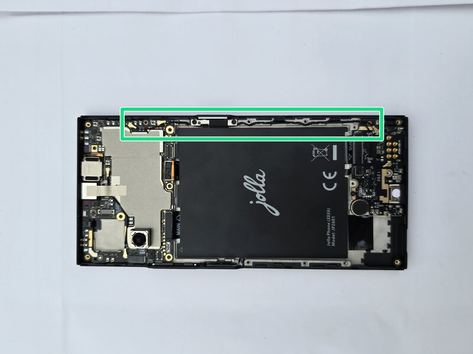

## Step 11: Step 11

- Unplug all connectors to the main board.
- Using the grounding tape, remove the front  facing camera, it is not glued down.
- Carefully lift out the main board

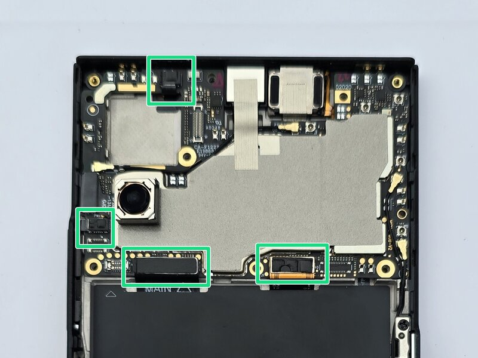

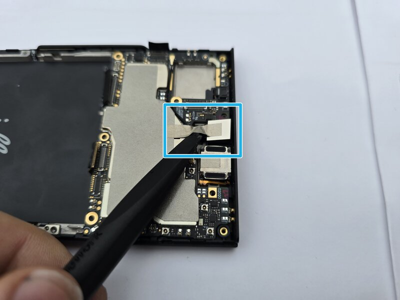

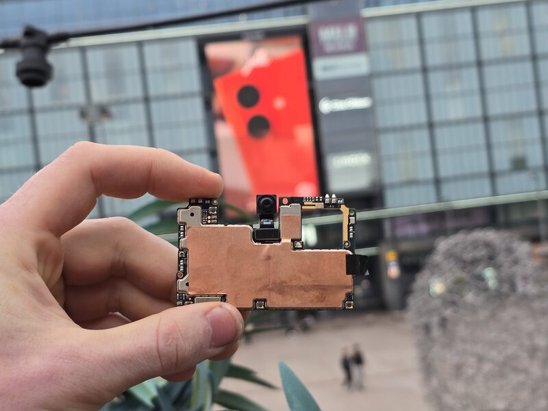

## Step 12: Step 12

- Using a PH0 screwdriver remove one screw.
- Unplug both connectors.
- Remove the SUB board by lifting it out.

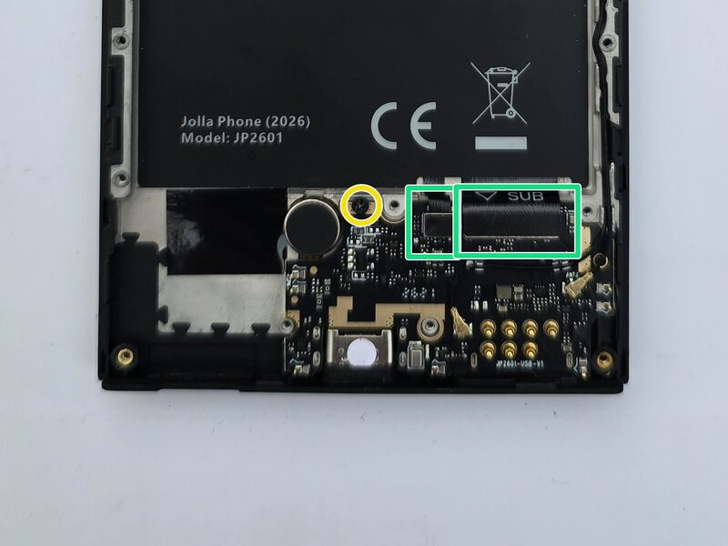

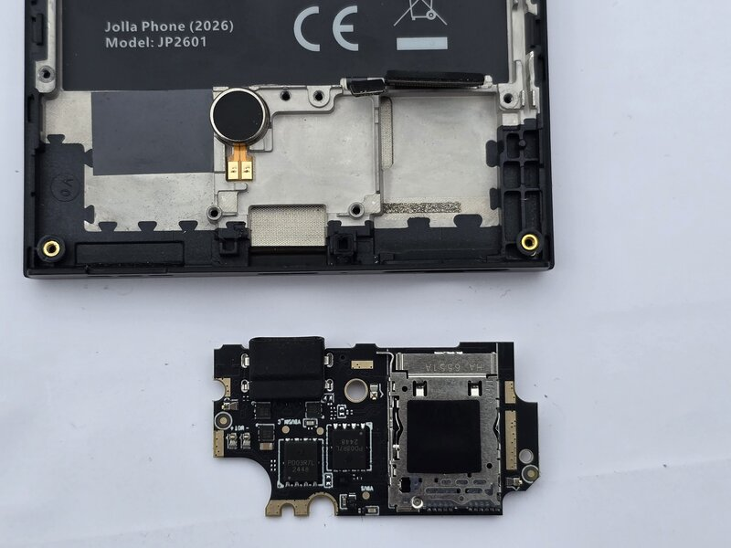
